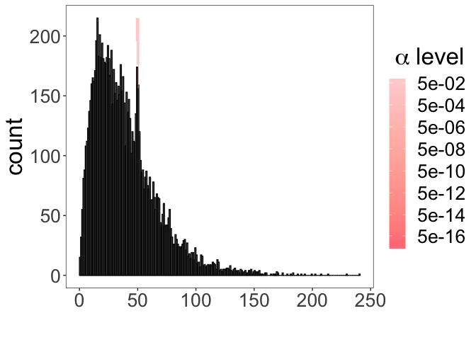

<!-- README.md is generated from README.Rmd. Please edit that file -->

# AnomDetct

<!-- badges: start -->

<!-- badges: end -->

The goal of AnomDetct is to detect embedded clusters in a given
continuous distributed sample. The cluster can be either a fix point
cluster or a cluster with small variance. The underlying distribution,
cluster locations and cluster size are not necessary to be specified.

## Installation

You can install the released version of AnomDetct from
[CRAN](https://CRAN.R-project.org) with:

``` r
install.packages("AnomDetct")
```

And the development version from [GitHub](https://github.com/) with:

``` r
# install.packages("devtools")
devtools::install_github("zhicongz/AnomDetct")
```

## Example

This is a basic example which shows you how to solve a common problem:

``` r
library(AnomDetct)
## generate sampled data with embedded cluster
set.seed(100);x <- c(rgamma(10000,2,0.05),rnorm(200,50,1))
res <- ultimate_detct(x, HRR_kernel = "gaussian", est_fun = "sbsp",
                      n_hz_sample = 50, n_hz_size = 200, MLE_unit = 5,
                      x_unit = 0.001)

## Returns
# 1. Quantile of clusters.
# 2. Location of clusters with differen significant level.
# 3. Plot

res
#> $Total
#> [1] 3025.062
#> 
#> $Cluster
#>         start      end      p-value
#> [1,] 48.42856 51.37475 0.0362910137
#> [2,] 49.19944 50.06607 0.0068846116
#> [3,] 50.21630 51.37475 0.0068846116
#> [4,] 50.21712 50.95406 0.0009955216
#> 
#> $plot
```


